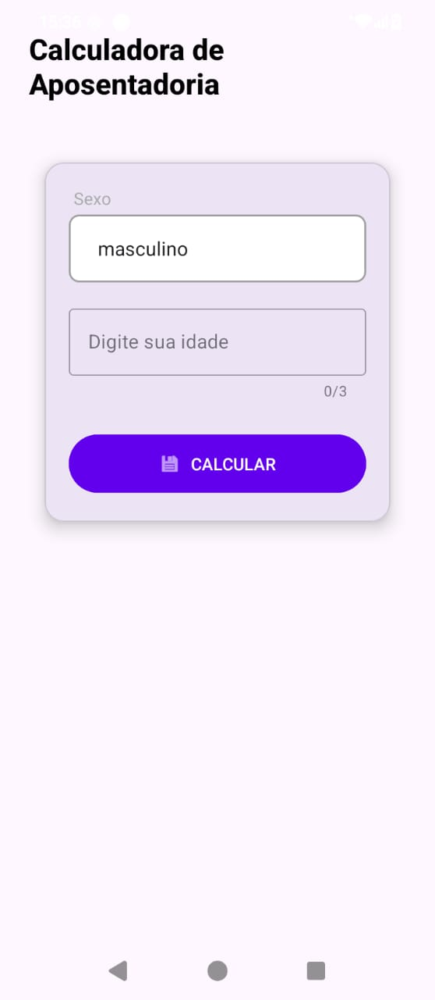

# Retirement Calculator

An Android application developed in Kotlin to calculate how much time is left until retirement based on the user's gender and age.

## About the Project

This project was developed using Android Studio, Kotlin, and Material Design components to provide a simple and user-friendly interface.

## Features

* Select gender (Male or Female);
* Enter age;
* Input validation;
* Calculate the remaining time until retirement;
* Display the result directly in the application.

## Retirement Rules

| Gender | Retirement Age |
| ------ | -------------- |
| Male   | 65 years       |
| Female | 60 years       |

## Technologies Used

* Kotlin
* Android Studio
* Android SDK
* Material Design Components
* ConstraintLayout

## Running the Application

### Requirements

* Android Studio
* JDK 11 or higher
* Android SDK 21 or higher

### Steps

1. Clone the repository:

```bash
git clone https://github.com/your-username/retirement-calculator.git
```

2. Open the project in Android Studio.

3. Sync Gradle dependencies.

4. Run the application on an emulator or Android device.

## Project Structure

```text
app/
├── src/main/java/
│   └── MainActivity.kt
├── src/main/res/
│   ├── layout/
│   ├── drawable/
│   └── values/
└── AndroidManifest.xml
```

## Validations

* The age field cannot be empty;
* Only numeric values are accepted;
* Invalid input handling.

## Future Improvements

* Calculation history;
* Dark mode support;
* Multiple language support;
* Result sharing;
* Additional retirement rules.

## Author

Lucian Alfred

## License

This project is available for educational and learning purposes.
